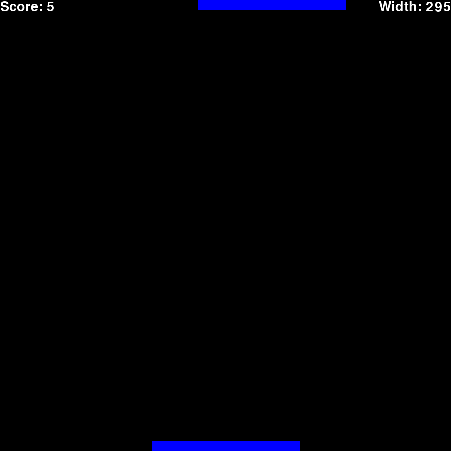
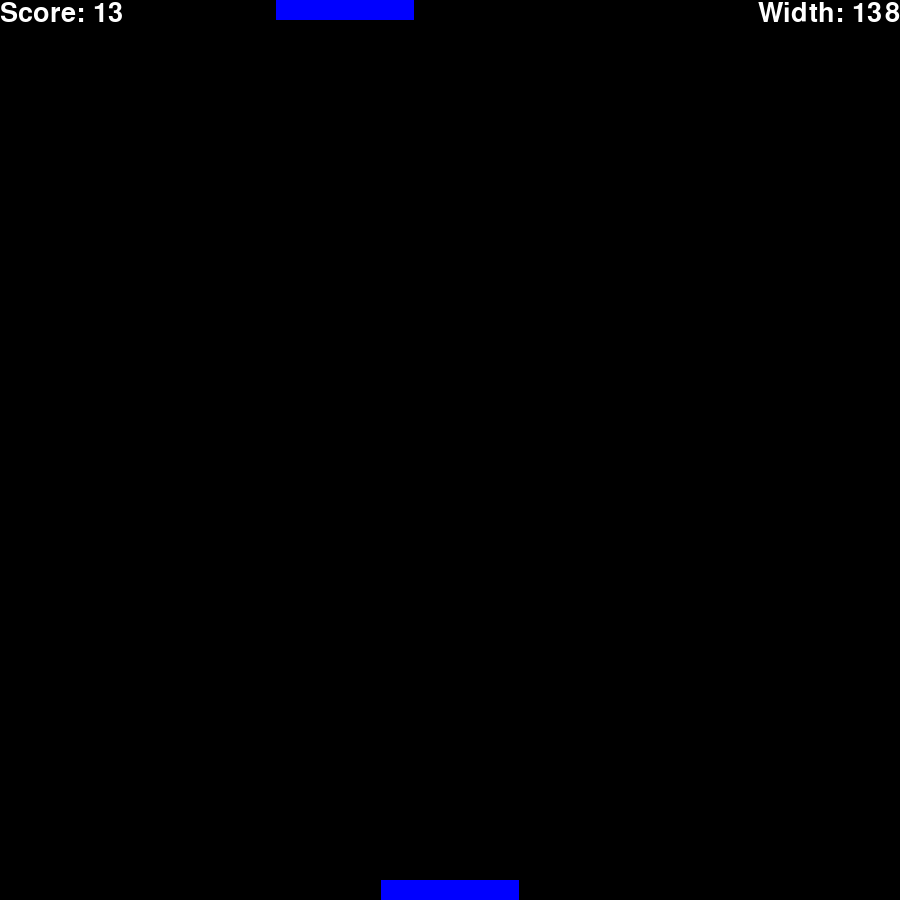
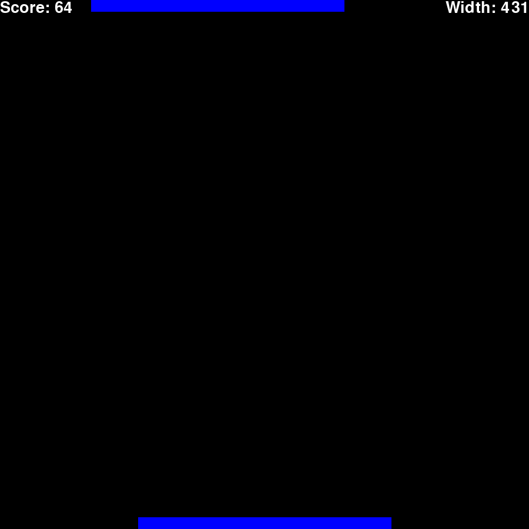

# stack-it
This is a little game that I made called Stack it!
# Install
Just clone this repo and in your terminal run:
```
pip install pygame
pip install time
```
# Use
### play.py

You can run this file to play Stack it! yourself.


As the bar moves along the top of the screen, it will slowly get faster.

When you drop it, it will fall and land on the bottom bar.

Any part of the bar that doesn't collide with the bottom bar will fall off the window.

This will repeat, but the bottom bar will always assume the length of the top one.

The game ends when the bar doesn't touch the bottom bar when dropped.

Controls:
- q to quit
- space to drop bar
- r to reset


...


### bad.py

BAD is so BAD its good! (wait what)

BAD, (Bar Alignment Dropper) isn't bad, its BAD.

Okaaayyyyy, BAD is just AI that plays Stack it! for you.

It waits until the bars are aligned, (or almost so) and the drops it.


